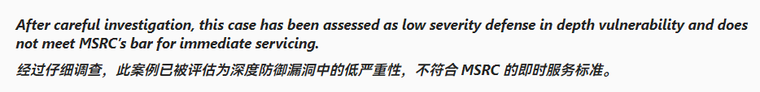

# FSRMEop
This is a program that utilizes FSRM for Windows Server privileges. Initially he could only do arbitrary file deletions, but now he can do arbitrary file writes.

MSRC response: 

And it's not the default service, so I'm publicizing it and discussing the case with the community.

## Usage

You need to create a file expiration task first. 

The scope is set to `C:\test`. the expiration directory is a random directory.

And set the expiration condition to be a file name matching *.txt ( actually makes it harder to exploit ).

https://github.com/Surager/FSRMEop/assets/55468511/b57061e2-7381-4e2f-a16d-abf381edc14f

